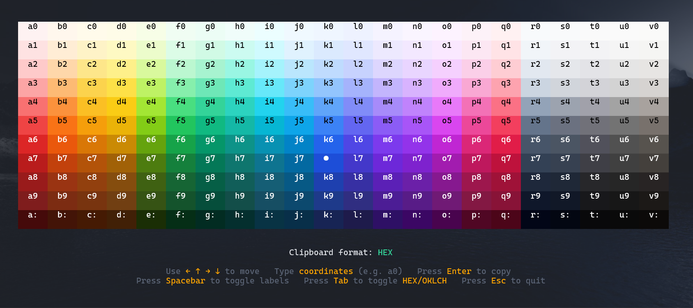

# Tailwind Terminal Color Picker

A simple terminal user interface (TUI) to explore and copy colors from the Tailwind CSS palette.

## Features

- Copy colors in `HEX` or `OKLCH` format to your clipboard
- Clean TUI built with [Bubbletea](https://github.com/charmbracelet/bubbletea)
- Inspired by [Tailwind CSS color documentation](https://tailwindcss.com/docs/colors)

## Controls

| Key       | Action                         |
|-----------|--------------------------------|
| `←↑→↓`    | Navigate through color grid     |
| `Enter`   | Copy selected color             |
| `Tab`     | Switch between HEX / OKLCH      |
| `Space`   | Toggle coordinate label hints   |
| `Esc`     | Quit the application            |

---

This tool is especially useful if you work with Tailwind CSS and prefer a quick, keyboard-driven way to explore and grab color values right from your terminal.
